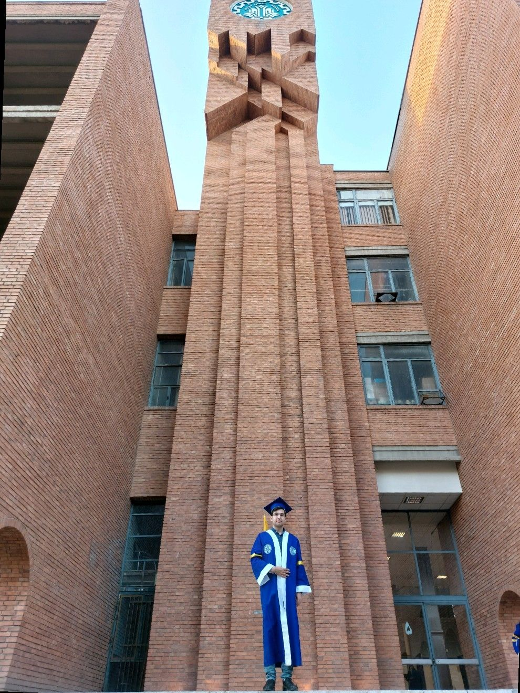
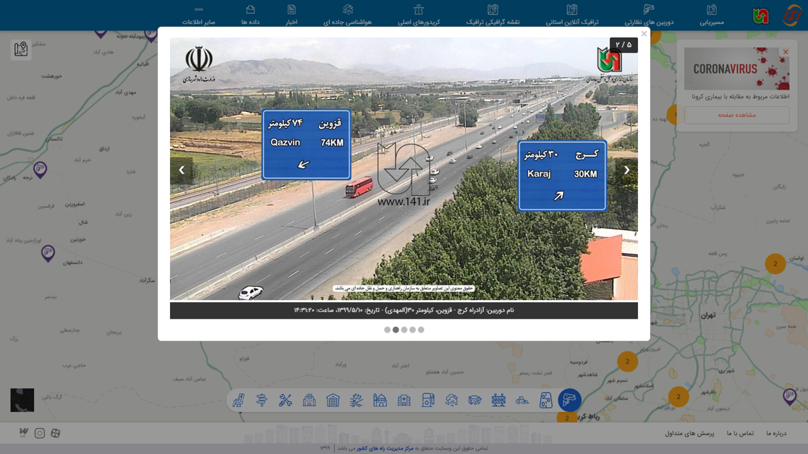
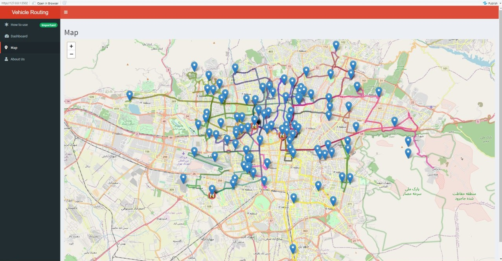
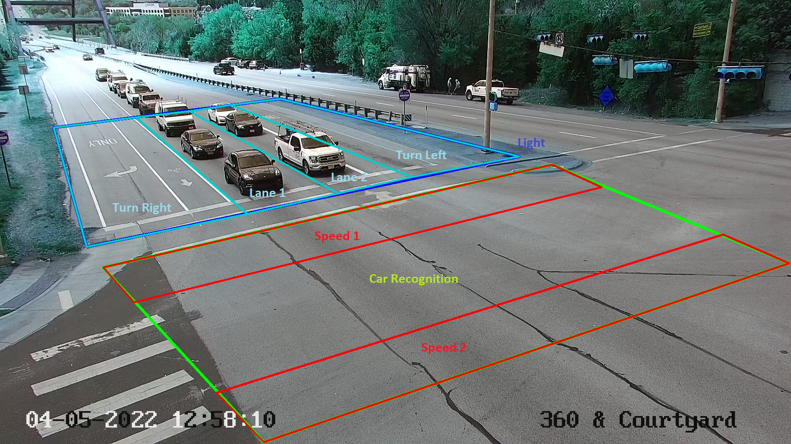
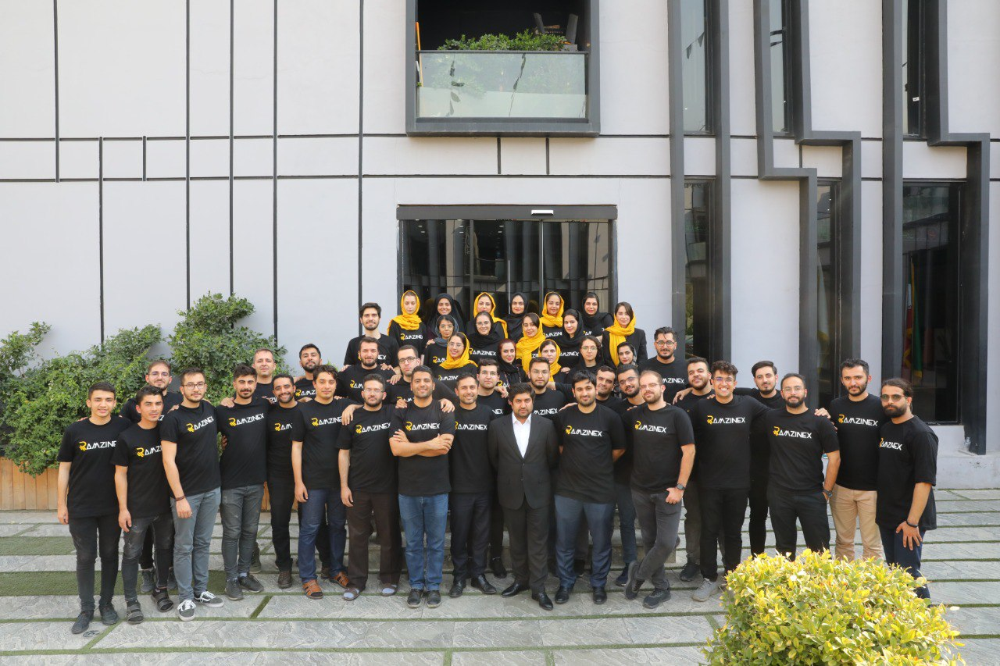

# About Me
I have finished my bachelor's in Civil Engineering at the Sharif University of Technology, the best technical university in Iran. As I pursued my education, I increasingly became interested in Transportation Engineering. I have had the opportunity to explore this field by engaging myself in projects dealing with Optimization, Traffic Safety, and Computer vision.

  

## Internship
The Roads and Transportation Information Management Center manages roads and highways by analyzing data collected from several sources. As a data analyst in this center, I detected malfunctioning traffic counters by developing a Python code that included data visualization. I also researched traffic and speed cameras in foreign countries and the information they provide.

  

## Bachelor's Thesis
My bachelor's thesis under Dr. Amir Samimi's supervision allowed me to dive deep into transportation and optimization problems. Our team researched different types and algorithms to solve urban freight transportation problems like vehicle routing problems (VRP) and pickup and delivery problems (PDP), which have several constraints, such as time windows, capacity, and the number of depots. We also developed an RShiny dashboard to solve these types of problems.

  

## Research
Professor Kara Kockelman allowed me to start research on inferring vehicle speeds, make, and models from video camera footage. This project broadened my horizons in computer vision and deep learning. Using YOLOv4, Deep SORT, and other Neural network tools, we detected, tracked, and recognized vehicles and measured their speeds.

  

## Work Experience
My programming skills in Python, data science, and artificial intelligence enriched at a fast pace along with my soft skills such as critical thinking, problem-solving, and dealing with new challenges that I had to solve on my path as a Quantitative Developer, Business Development Specialist, and Risk Management Specialist.

  

